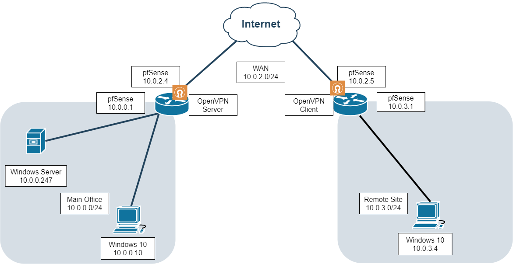

# Milestones by deliverables

# Implementation Timelines

**Objective 1** - Develop a Powershell script that can fully standup all requisite services to make the server into a DC when executed and installed on a new Windows Server.

**End Date**: 26/03

**Objective 2** - Build a site-to-site VPN tunnel.

**End Date**: 27/03

**Objective 3** - Deploy a RADIUS system that raises a captive portal .

**End Date**: 28/03

# Presentation Deliverables

## Each topic of the presentation must be completed by the following dates:
**A - Introduction** 
Deadline: 29/03

**B - Topical Overview** 
Deadline: 29/03

**C - Improvement Overview** 
Deadline: 29/03

**D - PowerShell Script Automation** 
Deadline: 29/03

**E - Final Thougths** 
Deadline: 29/03

# Project Report
Single File with the following topics: 
**G - Network Design** 
Deadline: 30/03

**H - Network Services** 
Deadline: 30/03

**I - OS Version Control** 
Deadline: 30/03

# System Diagrams
This is the network diagram we designed when planning the project deployment.

  